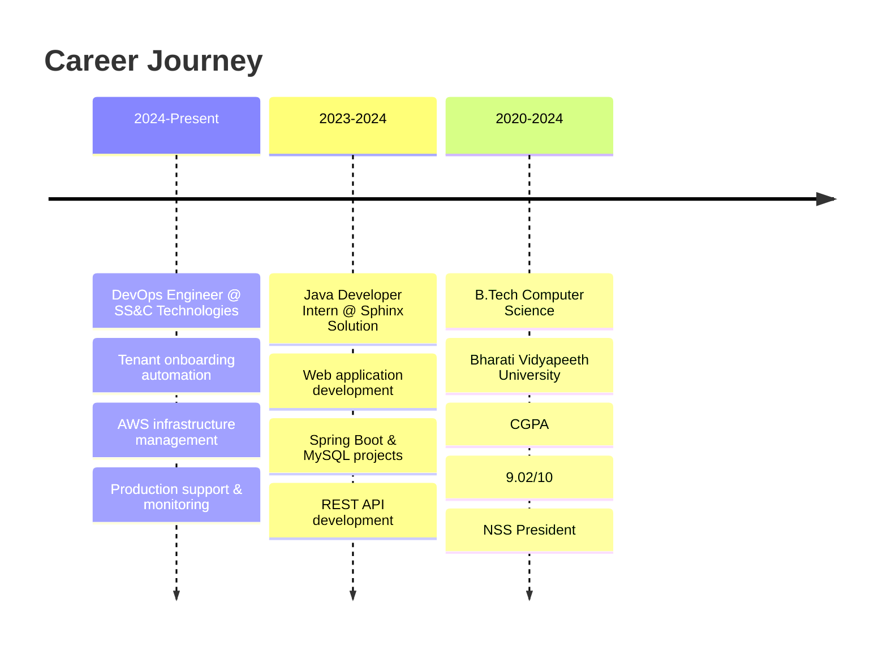

# 👋 Hi there, I'm Ronak Gupta!

<div align="center">
  
</div>

<div align="center">
  
  [](https://linkedin.com/in/ronak083)
  [](mailto:ronakgupta083@gmail.com)
  [](https://twitter.com/ronak083)
  
  

</div>

---

## 🚀 About Me

```yaml
name: Ronak Gupta
location: Bengaluru, India
current_role: DevOps Engineer @ SS&C Technologies
experience: 1.5+ years
passion: Cloud Infrastructure & Automation
currently_learning: AWS Solutions Architecture
fun_fact: Led 300+ volunteers as NSS President 🎯
```

🔭 **Currently working on:** Tenant onboarding automation & AWS infrastructure provisioning  
🌱 **Currently learning:** AWS Certified Solutions Architect (SAA-C03)  
⚡ **Fun fact:** Completed #100DaysOfCode challenge and shared daily progress!  
🎯 **2024 Goals:** Master Kubernetes orchestration & contribute to open-source DevOps tools

---

## 🛠️ Tech Stack & Tools

<div align="center">

### ☁️ Cloud & Infrastructure


### 🔧 DevOps & Automation


### 📊 Monitoring & Observability


### 💻 Programming & Scripting


### 🗄️ Databases & Storage


</div>

---

## 📈 GitHub Stats

<div align="center">
  
  
</div>

<div align="center">
  
</div>

---

## 🏆 Featured Projects

<div align="center">

[](https://github.com/Ronak083/cloud-resume-challenge)
[](https://github.com/Ronak083/quorumify)

</div>

### 🌟 Project Highlights

#### ☁️ Cloud Resume Challenge
- **Tech Stack:** Terraform, AWS (S3, CloudFront, Lambda, DynamoDB), GitHub Actions
- **Features:** Static website with serverless visitor counter, complete IaC automation
- **Achievement:** 100% Infrastructure as Code with CI/CD pipeline

#### 🗣️ Quorumify - Q&A Platform
- **Tech Stack:** Java Spring Boot, ReactJS, MySQL, Docker, JWT
- **Features:** Role-based access, REST APIs, responsive UI, containerized deployment
- **Achievement:** Full-stack application with security implementation

---

## 💼 Professional Experience



---

## 🎯 Current Focus

<div align="center">

| 🔭 Working On | 🌱 Learning | 🎯 Goals 2024 |
|:---:|:---:|:---:|
| Tenant Onboarding Automation | AWS Solutions Architecture | Kubernetes Mastery |
| Infrastructure Provisioning | Advanced Terraform Patterns | Open Source Contributions |
| Microservices Monitoring | GitOps with ArgoCD | Technical Blog Writing |

</div>

---

## 🏅 Achievements & Certifications

- 🎓 **AWS Certified Solutions Architect** (In Progress)
- 👨‍💼 **NSS President** - Led 300+ volunteers, organized 15+ social events
- 💻 **100 Days of Code** - Daily coding challenge with public learning
- 🩸 **Blood Donation Drive** - Organized university's largest donation campaign
- 🎯 **Academic Excellence** - 9.02 CGPA in Computer Science Engineering

---

## 📊 Weekly Development Breakdown

```text
DevOps & Infrastructure    ████████████████████████░   90%
Backend Development        ██████████████░░░░░░░░░░░   60% 
Cloud Architecture         ████████████████████░░░░░   80%
Automation & Scripting     ████████████████████████░   95%
Learning & Research        ███████████████░░░░░░░░░░   70%
```

---

## 🌐 Let's Connect!

<div align="center">

💬 **Open for opportunities** | 🤝 **Collaboration welcome** | 📚 **Always learning**

[](https://linkedin.com/in/ronak083)
[](mailto:ronakgupta083@gmail.com)
[](#)

</div>

---

<div align="center">
  
</div>

---

⭐ **If you find my work interesting, feel free to star my repositories and connect with me!**
